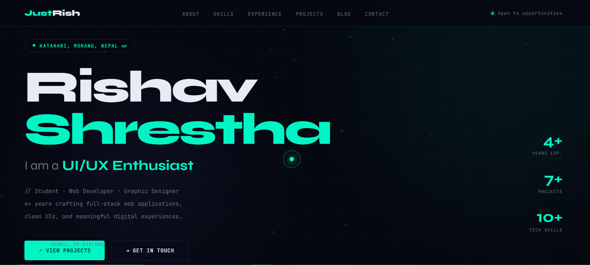

<div align="center">

# 🌐 Rishav Shrestha — Personal Portfolio

**A developer portfolio built with pure HTML, CSS & JavaScript**

[](https://www.shrestharishav.com.np)
[](https://github.com/RishavLC)
[](https://x.com/RishavShre91604)
[](mailto:shrestharishav444@gmail.com)


</div>

---

## 📋 Table of Contents

- [About](#-about)
- [Features](#-features)
- [Sections](#-sections)
- [Tech Stack](#-tech-stack)
- [Getting Started](#-getting-started)
- [Folder Structure](#-folder-structure)
- [Contact Form Setup](#-contact-form-setup)
- [Customization](#-customization)
- [Deployment](#-deployment)
- [License](#-license)

---

## 🧑‍💻 About

This is my personal developer portfolio — a single-page, fully responsive website showcasing my skills, projects, experience, and contact information. Built entirely with vanilla HTML, CSS, and JavaScript. No frameworks, no build tools, just clean code.

> Designed with a **dark & futuristic** aesthetic — featuring animated particles, a custom glowing cursor with trail effects, typewriter role animations, and smooth scroll-reveal transitions.

---

## ✨ Features

| Feature | Description |
|---|---|
| 🎯 **Custom Cursor** | Glowing dot cursor with a lagging ring and mouse-trail particle effect |
| ✍️ **Typewriter Effect** | Cycles through roles (Full-Stack Developer, Web Developer, Designer…) every ~3 seconds |
| 🌌 **Particle Network** | Animated floating particles with connecting lines in the background |
| 📜 **Scroll Reveal** | Sections and cards animate smoothly into view as you scroll |
| 🔗 **Active Nav Highlight** | Navigation links highlight based on the current visible section |
| 📬 **Working Contact Form** | Integrated with [Formspree](https://formspree.io) — messages go straight to Gmail |
| 📱 **Fully Responsive** | Works on all screen sizes — desktop, tablet, and mobile |
| ⚡ **Zero Dependencies** | No npm, no build step, no frameworks — just open and run |
| 🌙 **Dark Theme** | Full dark futuristic design with teal (`#00f5c4`) and indigo (`#6366f1`) accents |

---

## 📄 Sections

1. **Hero** — Name, animated typewriter roles, stats, and call-to-action buttons
2. **About** — Personal bio + interactive terminal-style JSON card
3. **Skills** — Tech stack cards: Frontend, Backend, Database, Design, DSA, Tools
4. **Experience** — Timeline of work experience and internships
5. **Projects** — Project cards with descriptions, tech tags, and GitHub links
6. **Blog** — Upcoming writing / articles section
7. **Contact** — Live contact form (Formspree) + social media links

---

## 🛠 Tech Stack

**Built with:**
- `HTML5` — Semantic structure
- `CSS3` — Custom properties, Grid, Flexbox, animations
- `Vanilla JavaScript` — Cursor FX, typewriter, particles, scroll reveal
- `Google Fonts` — Syne (headings) + JetBrains Mono (body)
- `Formspree` — Contact form backend (no server needed)

**No frameworks. No npm. No build tools.**

---

## 🚀 Getting Started

### Option 1 — Just open it
```bash
# Clone the repository
git clone https://github.com/RishavLC/rishav-site.git

# Navigate into the folder
cd rishav-site

# Open directly in your browser
open index.html
# or just double-click the file
```

### Option 2 — Use Live Server (VS Code)
1. Install the **Live Server** extension in VS Code
2. Right-click `index.html` → **Open with Live Server**
3. Done — hot reloads on every save

---

## 📁 Folder Structure

```
rishav-site/
│
├── index.html          # Main portfolio file (entire site)
├── README.md           # You are here
│
└── assets/             # (include images)
    └── preview.png     # Portfolio screenshot for README
```

> The entire site lives in a **single `index.html` file** — styles and scripts are all inline for maximum portability.

---

## 📬 Contact Form Setup

The contact form uses **[Formspree](https://formspree.io)** to forward messages directly to `shrestharishav444@gmail.com`.

If you fork this project and want the form to work for your email:

1. Go to [formspree.io](https://formspree.io) and create a free account
2. Create a new form and copy your endpoint URL (e.g. `https://formspree.io/f/xxxxxxxx`)
3. In `index.html`, find this line and replace the URL:

```javascript
const res = await fetch('https://formspree.io/f/mgodedkp', {
```

Replace `mgodedkp` with your own Formspree form ID.

4. Confirm your email on Formspree — you're live!

---

## 🎨 Customization

To make this your own, search and replace the following in `index.html`:

| What to change | Where to find it |
|---|---|
| Your name | `Rishav Shrestha` |
| Your role/tagline | `.htag` div and typewriter `roles` array in JS |
| Your location | `Katahari, Morang, Nepal` |
| Your email | `shrestharishav444@gmail.com` |
| GitHub URL | `https://github.com/RishavLC` |
| Twitter URL | `https://x.com/RishavShre91604` |
| Accent color | `--accent: #00f5c4` in `:root` CSS variables |
| Projects | `.pcard` blocks in the Projects section |
| Skills | `.skcard` blocks in the Skills section |

---

---
## 📸 Preview

<p align="center">
  
</p>

---

## 📜 License

This project is open source and available under the [MIT License](LICENSE).

Feel free to fork, customize, and use it for your own portfolio. A credit or star ⭐ is always appreciated!

---

<div align="center">

**Built with Caffine❤️ from Nepal 🇳🇵 by [Rishav Shrestha](https://github.com/RishavLC)**

*Student · Full-Stack Developer · Graphic Designer*

[](https://github.com/RishavLC/rishav-site)

</div>
